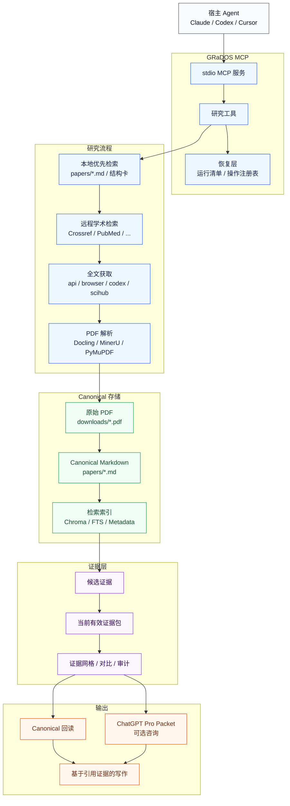

# GRaDOS

[English](./README.md) | [简体中文](./README.zh-CN.md)

<div align="center">
  <pre style="display:inline-block; margin:0; font-family:'Bitstream Vera Sans Mono', 'SF Mono', Consolas, monospace; font-size:15px; line-height:1.02; font-weight:bold; white-space:pre; text-align:left;">&nbsp;&nbsp;.oooooo.&nbsp;&nbsp;&nbsp;&nbsp;ooooooooo.&nbsp;&nbsp;&nbsp;&nbsp;&nbsp;&nbsp;&nbsp;&nbsp;&nbsp;&nbsp;&nbsp;&nbsp;&nbsp;oooooooooo.&nbsp;&nbsp;&nbsp;&nbsp;&nbsp;.oooooo.&nbsp;&nbsp;&nbsp;&nbsp;.oooooo..o
&nbsp;d8P'&nbsp;&nbsp;`Y8b&nbsp;&nbsp;&nbsp;`888&nbsp;&nbsp;&nbsp;`Y88.&nbsp;&nbsp;&nbsp;&nbsp;&nbsp;&nbsp;&nbsp;&nbsp;&nbsp;&nbsp;&nbsp;`888'&nbsp;&nbsp;&nbsp;`Y8b&nbsp;&nbsp;&nbsp;d8P'&nbsp;&nbsp;`Y8b&nbsp;&nbsp;d8P'&nbsp;&nbsp;&nbsp;&nbsp;`Y8
888&nbsp;&nbsp;&nbsp;&nbsp;&nbsp;&nbsp;&nbsp;&nbsp;&nbsp;&nbsp;&nbsp;&nbsp;888&nbsp;&nbsp;&nbsp;.d88'&nbsp;&nbsp;.oooo.&nbsp;&nbsp;&nbsp;&nbsp;888&nbsp;&nbsp;&nbsp;&nbsp;&nbsp;&nbsp;888&nbsp;888&nbsp;&nbsp;&nbsp;&nbsp;&nbsp;&nbsp;888&nbsp;Y88bo.&nbsp;&nbsp;&nbsp;&nbsp;&nbsp;
888&nbsp;&nbsp;&nbsp;&nbsp;&nbsp;&nbsp;&nbsp;&nbsp;&nbsp;&nbsp;&nbsp;&nbsp;888ooo88P'&nbsp;&nbsp;`P&nbsp;&nbsp;)88b&nbsp;&nbsp;&nbsp;888&nbsp;&nbsp;&nbsp;&nbsp;&nbsp;&nbsp;888&nbsp;888&nbsp;&nbsp;&nbsp;&nbsp;&nbsp;&nbsp;888&nbsp;&nbsp;`"Y8888o.&nbsp;
888&nbsp;&nbsp;&nbsp;&nbsp;&nbsp;ooooo&nbsp;&nbsp;888`88b.&nbsp;&nbsp;&nbsp;&nbsp;&nbsp;.oP"888&nbsp;&nbsp;&nbsp;888&nbsp;&nbsp;&nbsp;&nbsp;&nbsp;&nbsp;888&nbsp;888&nbsp;&nbsp;&nbsp;&nbsp;&nbsp;&nbsp;888&nbsp;&nbsp;&nbsp;&nbsp;&nbsp;&nbsp;`"Y88b
`88.&nbsp;&nbsp;&nbsp;&nbsp;.88'&nbsp;&nbsp;&nbsp;888&nbsp;&nbsp;`88b.&nbsp;&nbsp;d8(&nbsp;&nbsp;888&nbsp;&nbsp;&nbsp;888&nbsp;&nbsp;&nbsp;&nbsp;&nbsp;d88'&nbsp;`88b&nbsp;&nbsp;&nbsp;&nbsp;d88'&nbsp;oo&nbsp;&nbsp;&nbsp;&nbsp;&nbsp;.d8P
&nbsp;`Y8bood8P'&nbsp;&nbsp;&nbsp;o888o&nbsp;&nbsp;o888o&nbsp;`Y888""8o&nbsp;o888bood8P'&nbsp;&nbsp;&nbsp;&nbsp;`Y8bood8P'&nbsp;&nbsp;8""88888P'&nbsp;</pre>
</div>

<p align="center">
  <strong style="font-size:1.75rem;">Graduate Research and Document Operating System</strong>
</p>

面向学术论文工作流的“丰富学习级” MCP 服务器。为了科学。

GRaDOS 为 Claude、Codex、Cursor 等 AI agent 提供单一 stdio MCP 服务，用来检索学术数据库、跨付费墙抓取论文、把 PDF 解析为 canonical Markdown，并在写作时回读已保存论文做引用核验。

## 架构概览 🧭

GRaDOS 保持一个清晰边界：host agent 负责规划和写作；GRaDOS 负责检索、物化、核验和保存证据。



核心约束：

- 先查本地论文库，再按配置检索远程来源，并通过配置好的全文路径抓取论文。
- PDF 会被解析为 canonical Markdown；原始 PDF、parser provenance、assets、语义索引、词法索引和远程 metadata 都保留在可见目录中。
- Search snippet、score、evidence grid、comparison 和 audit 都只是导航材料。最终引用依据必须来自 `read_saved_paper` 回读的 canonical 段落，或 `verify_evidence_pack` 返回 `current_valid=true` 的 pack。
- ChatGPT Pro packet、`research_run_manifest` 和 Operation Registry record 只是 advisory 或恢复元数据，不能替代 canonical 论文正文作为证据。
- Evidence-grounded writing 位于内置 skill 的 `references/paper_writing.md` 及其 profiles；MCP runtime 仍然只承担证据和恢复层。

## MCP Toolsets 🧰

默认情况下，MCP `tools/list` 暴露 `research_default` profile，而不是所有 GRaDOS public tools。这样普通研究 agent 会优先看到端到端研究闭环所需的工具：本地/远程检索、全文获取、结构卡、canonical 回读、operation polling、evidence pack、审计、evidence grid、对比、默认 external consult，以及 run-linked artifact 保存。

Toolsets 只控制 MCP 工具可见性；不会删除 Python 函数、CLI 命令、resources、内部 workflow 或既有存储路径。`grados://papers/index` 和 `grados://papers/{safe_doi}` 两个论文资源默认仍会注册，也不计入工具数量。

| 设置 | 暴露工具 |
| --- | --- |
| 未设置 / `GRADOS_MCP_TOOLSETS=research_default` | 默认研究 workflow 工具。 |
| `GRADOS_MCP_TOOLSETS=all` 或 `GRADOS_MCP_TOOLSETS=full` | 完整 public MCP surface，目前为 32 个工具。 |
| `GRADOS_MCP_TOOLSETS=research_default,local_pdf` | 默认研究工具，加上本地 PDF import/parse/handoff/asset 工具。 |
| `GRADOS_MCP_TOOLS=read_saved_paper,prepare_evidence_pack` | 未同时设置 toolset 时，作为精确工具 allow-list。 |
| `GRADOS_MCP_TOOLSETS=research_default` 加 `GRADOS_MCP_TOOLS=read_paper_asset` | 默认 profile 加显式指定工具。 |

可用 toolsets：`research_default`、`local_pdf`、`analysis_extra`、`evidence_extra`、`evidence_recovery`、`external_recovery`、`maintenance`、`zotero`、`all` 和 `full`。未知 toolset 或工具名会在 server 启动时 fail-fast，避免 MCP client 静默运行在错误暴露面上。

## MCP 工具 🔧

| 服务 | 工具 | 说明 |
| --- | --- | --- |
| GRaDOS | `search_academic_papers` | 检索远程学术数据库中的论文元数据，支持 DOI 去重、continuation token 续查，并暴露本地保存/全文/summary 状态。可选 `indepth=true` 会用同一个 `limit` 为返回候选启动后台 research run；用返回的 operation id 调 `get_operation_status` 查询。 |
| GRaDOS | `search_saved_papers` | 检索本地已保存论文库，支持语义检索、SQLite FTS/BM25 fallback、exact lookup、metadata 过滤与 hybrid RRF。返回的 snippet 和 Evidence Anchor JSON block 只是筛选/重排线索，不是最终引用证据。 |
| GRaDOS | `extract_paper_full_text` | 按 DOI 抓取、解析、QA 校验并保存单篇论文的 canonical 全文。已保存和 native-full-text 路径保持同步返回；PDF-obtained 解析可返回 pending operation receipt。 |
| GRaDOS | `read_saved_paper` | 从单篇已保存论文中读取段落窗口，用于 canonical 深读与引用核验。可通过 DOI、safe DOI 或 `grados://papers/...` URI 定位论文。 |
| GRaDOS | `get_saved_paper_structure` | 返回单篇论文的低 token 结构卡片，包含预览、章节标题、资产摘要，以及可用时的 parser provenance summary。适合深读前筛选，不应替代最终引用依据。 |
| GRaDOS | `read_paper_asset` | 列出或读取已保存论文的 parser assets，包括图片、表格、公式、页面图和 debug/source 文件。图片只在显式请求且低于尺寸上限时内联返回。 |
| GRaDOS | `import_local_pdf_library` | 扫描本地 PDF 文件或目录，然后把逐 PDF 解析/导入作为后台 import run 推进。返回 `operation_id`、进度和 `get_operation_status` 下一步。 |
| GRaDOS | `parse_pdf_file` | 把本地 PDF 解析为 markdown。未提供 DOI 时返回截断预览；提供 DOI 时会保存进 canonical 论文库，并在 `copy_to_library=true` 时 materialize 受管 PDF；长解析可先返回 `parse_in_progress`，GRaDOS 后台继续同一个 durable parse attempt。 |
| GRaDOS | `get_operation_status` | 查询 pending external consult、DOI-bound extraction/PDF parse、indepth search、本地 PDF import 或 Codex download handoff operation。Extraction 状态也可用 `doi:<DOI>` 或裸 DOI 查询。`detail=true` 可在不重复发送 prompt 的情况下恢复 ChatGPT browser 响应，并返回 registry events/debug 指针。 |
| GRaDOS | `ingest_codex_downloaded_pdf` | 完成 `codex` Chrome extension handoff：校验 `downloaded_file_path` 或 watch dir 中唯一候选 PDF，然后复用同一条 canonical parse/save 路径；歧义、缺失或失败会记录为可恢复的 `codex_download_handoff` operation，长解析中的候选会返回 in-progress 而不是 parse failure。 |
| GRaDOS | `plan_library_pdf_cleanup` | dry-run 扫描 `downloads/` 中与 DOI 受管 `downloads/{safe_doi}.pdf` hash 相同的非 canonical publisher-name PDF，只生成报告，不删除文件。 |
| GRaDOS | `save_paper_to_zotero` | 通过 Zotero Web API 把单篇论文保存到当前配置的 Zotero 库，通常用于最终答案里实际引用到的论文。 |
| GRaDOS | `save_research_artifact` | 把 search snapshot、extraction receipt、evidence grid、compression-safe evidence checkpoint 和 run-linked artifact 等可复用中间产物持久化到本地 SQLite 状态库；传入 `metadata.research_run_id` 可把 artifact 挂到 run manifest。 |
| GRaDOS | `query_research_artifacts` | 按 id、kind 或关键词查询已保存的 research artifact；`detail=true` 会返回完整内容。 |
| GRaDOS | `prepare_evidence_pack` | 召回候选 anchor，回读 `papers/*.md` 中的 canonical blocks，过滤非证据片段，并持久化最小 `evidence_pack` artifact，包含 pack hash、block hash、answerability 和 scoped DOI 覆盖状态。 |
| GRaDOS | `read_evidence_pack` | 通过 pack id 或 artifact id 恢复已保存的 evidence pack。 |
| GRaDOS | `verify_evidence_pack` | 从当前 `papers/*.md` 重建 canonical block manifest，并报告 snapshot/current validity、missing paper、document change、relocation 和 hash mismatch。 |
| GRaDOS | `preview_external_consult_packet` | 从 current-valid evidence pack dry-run 紧凑 external-consult packet，不保存 artifact，也不调用外部服务。 |
| GRaDOS | `prepare_external_consult_packet` | 持久化 `external_consult_packet` artifact，包含 verified anchor id、canonical 段落坐标、excerpt、candidate claim、limitations 和 prompt hash，并把 host prompt 作为可再生成视图返回。 |
| GRaDOS | `prepare_external_consult_from_topic` | 从 topic 准备 fresh evidence pack，并在同一路线中持久化 verified external-consult packet，返回 pack/packet id 和 host prompt。 |
| GRaDOS | `consult_chatgpt_pro` | 通过私有 GRaDOS browser profile 咨询 ChatGPT Pro。必须提供 prompt；pack、packet、artifact 和文件只是可选上下文。它会记录 model/thinking strategy，单次发送 prompt，默认 bounded auto-reattach，保存 advisory output，支持用 `manual_response` 保存手动粘贴 fallback，且不默认 audit。 |
| GRaDOS | `run_external_consult` | 把 topic 或 current-valid pack 准备成 external consult packet context，再通过 `consult_chatgpt_pro` 发送；这个 route 不再默认 audit。 |
| GRaDOS | `save_external_consult_result` | 把 host 提供的 ChatGPT Pro 回复保存为 advisory `external_consult_result` 状态，并关联 source pack、可选 packet、prompt hash 和 session metadata；默认 `audit=true`。 |
| GRaDOS | `audit_external_consult_result` | 优先按已关联 packet 审计 external consult 结果，没有 packet 时才退回 source pack；结构化 `claims[].anchor_ids` 是主要交接合同，正文 audit 作为风险扫描保留。 |
| GRaDOS | `audit_answer_against_pack` | 只使用单个 pack 内的 evidence items 审计草稿 claims，返回 `verified`、`minor_distortion`、`major_distortion`、`unverifiable` 或 `unverifiable_access` verdict，不会全库搜索来填补缺口；可用 `include_suggestions=true` 附带后续补证建议。 |
| GRaDOS | `suggest_missing_evidence` | 针对 pack audit 中非 `verified` 的 claim 给出后续补证或修改建议，不改变 strict audit 结论。 |
| GRaDOS | `manage_failure_cases` | 记录、查询并总结 fetch、parse、search 或 citation 失败案例，也能给出保守的重试建议。 |
| GRaDOS | `get_citation_graph` | 返回本地论文库中的轻量引用关系，包括引用邻居、共同参考文献和反向 citing-paper 查询。 |
| GRaDOS | `get_papers_full_context` | 为按上下文预算分批的已保存论文返回结构化全文上下文，可先拿 token 估计，也可直接进入 CAG 风格的深读模式。 |
| GRaDOS | `build_evidence_grid` | 围绕主题或子问题，从本地论文库构建写作前的证据网格；行内带可回读 anchor，供 agent-side reranking 后再核验引用，scoped DOI 调用会报告 requested/covered/missing 覆盖状态，弱证据行会暴露 `eligibility`、`rejection_reason` 和 `evidence_warning`，不再伪装成 citation-ready。 |
| GRaDOS | `compare_papers` | 跨多篇已保存论文抽取并行对比材料，聚焦 methods、results 或 full text；返回 excerpt 会带每个对比轴的回读 anchor，默认避开后置噪声 section，并在没有合格 excerpt 时留空该轴。 |
| GRaDOS | `audit_draft_support` | 审计草稿中的 claim 是否被本地论文库支持，返回 first-pass `verified`、`minor_distortion`、`major_distortion`、`unverifiable` 或 `unverifiable_access` verdict，以及合格候选 evidence snippet、issue type、revision action 和 anchor；`author_year` citation 包括括号/方括号 marker，以及 `Dou et al. (2026)`、`Dou et al., 2026`、`张三等，2025` 这类 narrative marker，检索 query 会剥离 author/year，但 attribution check 仍保持严格；`candidate_limit` 控制每条 claim 的候选数。 |

### MCP 资源 📚

| 资源 | 说明 |
| --- | --- |
| `grados://papers/index` | 所有已保存论文的低 token 索引。 |
| `grados://papers/{safe_doi}` | 单篇已保存论文的 canonical 概览卡片。 |

`safe_doi` 是 GRaDOS 在保存回执、搜索结果或 resource URI 中返回的 opaque paper ID。新保存的论文会在可读 slug 后追加一段 normalized DOI hash，避免文件名碰撞；旧的 `10_1234_demo` 形式仍可读取。优先传 DOI 本身或工具返回的 URI，不要自己把 DOI 标点替换成 paper ID。

## 本地论文库 🗂️

提取或导入之后，GRaDOS 会把论文保存在一套可见的目录结构里：

| 目录 | 内容 | 用途 |
| --- | --- | --- |
| `config.json` | 运行时配置 | 整个安装共用的单一配置文件 |
| `papers/` | 带 YAML front-matter 的 canonical Markdown 论文 | 深读、结构卡片与检索 |
| `papers/_parsed/` | 以 safe DOI 命名的 parser provenance sidecar | PDF/parser provenance、source/canonical hash、block mapping 和 asset manifest 指针；不是引用正文 |
| `papers/_assets/` | Parser 生成的资产和 manifest | 图片、表格、公式、页面图和 source/debug assets，通过 `read_paper_asset` 读取；不作为正文索引 |
| `downloads/` | 原始 `.pdf` 文件 | 抓取或导入后的归档副本 |
| `database/chroma/` | ChromaDB collections | 内置语义检索存储 |
| `database/fts.sqlite3` | 可重建 SQLite FTS5/BM25 索引 | 确定性词法 fallback 与 hybrid retrieval 候选生成 |
| `database/remote_metadata/` | ChromaDB collection | 远程论文 metadata、fetch 状态与浏览器恢复缓存 |
| `database/research.sqlite3` | Research artifacts 与 failure memory | Evidence packs、run manifests、checkpoints、extraction receipts 和可恢复失败记录 |
| `research_checkpoints/` | `checkpoint.json` 与渲染后的 `checkpoint.md` | 可恢复的 indepth 研究工作流状态 |
| `paper_summaries/` | query-independent 的派生论文 summary | 导航与上下文恢复，不能作为引用依据 |
| `browser/` | 托管 Chromium、publisher/ChatGPT profiles、session records | publisher PDF 访问和 gated ChatGPT 外部综合所需的浏览器资产 |
| `models/` | embedding 与 OCR 模型缓存 | setup 预热的运行时资产 |

## 仓库地图 🗺️

- `README.md` / `README.zh-CN.md`：主要安装与使用说明
- `.mcp.json`：仓库内 MCP 配置示例
- `.claude-plugin/`：Claude Code 的原生 plugin manifest
- `.agents/plugins/marketplace.json`：repo-hosted 的 Codex marketplace manifest
- `plugin.mcp.json`：Claude Code 插件使用的根目录插件专用 MCP 配置
- `plugins/grados/.codex-plugin/`：给 Codex marketplace 用的自包含 plugin bundle
- `plugins/grados/plugin.mcp.json`：复制进 Codex plugin bundle 的插件专用 MCP 配置
- `skills/grados/SKILL.md`：构建在 MCP 工具之上的结构化科研工作流
- `skills/grados/references/paper_writing.md`：evidence-grounded writing workflow router
- `skills/grados/references/writing_profiles/`：实验流程、综述、实验报告和 manuscript 写作 profile
- `skills/grados/references/domain_profiles/`：领域写作 guardrail，目前包含力学与弹性超材料 profile

## 安装 🚀

### 方式 A：`uv tool install`（推荐）

```bash
uv tool install grados
grados setup
grados client install all
```

这会创建 `~/GRaDOS/config.json`，准备可见目录结构，安装托管浏览器资产，并预热默认的 Harrier embedding 运行时。由于当前 canonical 解析链已经改为 Docling 优先，默认安装现在也会自带 `docling`。MinerU 作为同一瀑布中的可选认证云端解析器，只有在配置了 `MINERU_API_KEY` 时才会运行。
推荐用 `grados auth set <provider>` 把 API Key 写入系统 keychain。若你临时把明文 key 填进 `config.json`，GRaDOS 会在下次运行时自动导入 keychain，并在迁移成功后清空原文件中的明文值。

### 方式 B：extras、零安装或 pip

```bash
# 默认安装（已包含 Docling）
uv tool install grados

# 零安装运行
uvx grados version

# 传统 Python 安装
pip install grados
```

当前包的 extras：

- `grados`：核心 MCP 服务、CLI、ChromaDB 存储、Docling-first 解析器、可选 MinerU 云端 fallback、PyMuPDF fallback、浏览器自动化，以及内置 Zotero 保存能力
- `grados[docling]`：为了兼容旧安装说明而保留的空 alias
- `grados[marker]`：仅兼容旧安装命令的空 alias；当前 `marker-pdf` 版本会钉住存在漏洞的解析依赖，因此不再随包安装
- `grados[full]`：仅兼容旧安装命令的空 alias

### 方式 C：从源码运行

```bash
git clone https://github.com/STSNaive/GRaDOS.git
cd GRaDOS
uv sync --all-extras
uv run grados setup
uv run grados client install all
uv run grados status
```

### 快速开始 ⚡

1. 用 `uv tool install grados` 安装 GRaDOS（现在默认就会安装 Docling）
2. 运行 `grados setup`
3. 运行 `grados client install all`，一步接入 Claude Code 和 Codex
4. 运行 `grados auth set elsevier`（以及你需要的其他 provider）
5. 运行 `grados status` 检查依赖、浏览器资产、keychain 健康状态和 API Key 来源
6. 如果你已经有 PDF 库，运行 `grados import-pdfs --from /path/to/papers --recursive`
7. 如果你是从旧的 MiniLM 语义索引升级，请先执行一次 `grados reindex`

### 配置客户端 🔌

推荐方式：

```bash
grados client install all
```

当前 `all` 会同时安装到 Claude Code 和 Codex，并自动：

- 通过各自客户端的官方 CLI 注册 `grados` MCP 服务
- 把内置的 `grados` skill 复制到用户 skills 目录

也可以单独安装到某一个客户端：

```bash
grados client install claude
grados client install codex
grados client list
grados client doctor
```

### 手工配置 MCP（fallback）

Claude Code / Claude Desktop：

```json
{
  "mcpServers": {
    "grados": {
      "command": "uvx",
      "args": ["grados"]
    }
  }
}
```

Codex：

```toml
[mcp_servers.grados]
command = "uvx"
args = ["grados"]
```

`uvx` 适合零安装启动 MCP。长期本地使用仍建议 `uv tool install grados` 加 `grados` 可执行命令，而且现在会默认带上 Docling。如果你想指定自定义数据根目录，请在 MCP 客户端环境变量里设置 `GRADOS_HOME`。

### 原生 Plugin 安装 🧩

GRaDOS 现在同时支持 Codex 和 Claude Code 的原生 plugin。

Claude Code：

```text
/plugin marketplace add STSNaive/GRaDOS
/plugin install grados@grados-plugins
/reload-plugins
```

Codex：

```text
codex plugin marketplace add STSNaive/GRaDOS
codex
/plugins
```

然后选择 `GRaDOS Plugins` marketplace，安装 `GRaDOS` 插件，再新开一个线程。你可以直接写 `@grados`，也可以直接描述科研任务。

### 配套 Skill 🤖

GRaDOS 仓库仍然自带配套 skill，位置在 `skills/grados/`。现在更推荐优先使用上面的 `grados client install ...` 本地安装路径；plugin 安装适合你明确想走原生 plugin 包装时使用。

- `skills/grados/SKILL.md` 对应当前 `search -> structure -> deep read -> cite -> verify` 工作流
- `skills/grados/references/tools.md` 记录当前 MCP 工具和 2 个资源
- `skills/grados/references/paper_writing.md` 把 evidence-grounded 写作任务路由到实验流程、综述、实验报告和 manuscript 等细分 profile
- `skills/grados/agents/openai.yaml` 声明了面向 OpenAI / Codex 的 `grados` MCP 依赖

Codex 和 Claude Code 使用的是同一种 skill 目录形状，也就是 `<skills-root>/grados/SKILL.md`，并共享同一套目录下的辅助文件。区别只在 skills 根目录：

- Codex 个人 skills：`~/.agents/skills`
- Claude Code 个人 skills：`~/.claude/skills`
- Claude Code 项目级 skills：`.claude/skills`

安装时请复制**整个** `skills/grados/` 目录到对应的 skills 根目录，而不是只复制 `SKILL.md`：

```bash
mkdir -p "<skills-root>"
cp -R skills/grados "<skills-root>/"
```

- Codex：把 `<skills-root>` 设为 `~/.agents/skills`
- Claude Code 个人 skills：把 `<skills-root>` 设为 `~/.claude/skills`
- Claude Code 项目级 skills：把 `<skills-root>` 设为 `.claude/skills`

这个 fallback 路径默认假设你的客户端已经注册好了 `grados` MCP 服务。仓库里的 `.mcp.json` 提供了最小 repo-local 示例；复制完 skill 之后，重新加载客户端即可让它发现新的 skill 文件。

## 配置 ⚙️

注释齐全的参考配置以 [grados-config.example.json](./grados-config.example.json) 为准；修改后会在下一次 CLI 运行或 MCP 服务重启时生效。

### 研究工作流开关

- `research.indepth`：默认关闭；控制远程检索是否立即 materialize 返回候选，用于 checkpoint 化的全文评审。
- `research.external_consult`：默认关闭；包含 `enabled` 与 `response_wait_total_seconds`，表示 GRaDOS-native ChatGPT Pro consult transport 及总响应等待预算。自动化 gate 用 `grados external-consult is-enabled --quiet`；诊断细节用 `grados external-consult status --json`；首次登录私有 profile 用 `grados external-consult setup-browser`。启用时 GRaDOS 可以通过私有 ChatGPT browser profile 执行 prompt-only 或 bounded-context consult、保存 advisory response，并在需要时用显式后续工具审计 pack-linked result；关闭时 GRaDOS 不调用 ChatGPT、不打开 Chrome，也不改变证据读取流程。

### 超时与重试

- `search`: `connect_timeout`, `read_timeout`
- `extract`: `fetch_connect_timeout`, `fetch_read_timeout`, `pdf_read_timeout`
- `extract.headless_browser`: `browser` 策略的 legacy 命名配置段（`deadline_seconds`, `networkidle_timeout`, `pdf_backfill_timeout`, `poll_min_seconds`, `poll_max_seconds`）
- `research.external_consult`: `response_wait_total_seconds`
- `extract.codex_handoff`: 只服务 `codex` Chrome extension handoff 之后的 watch-dir ingest（`download_watch_dir`, `download_max_age_seconds`, `download_settle_seconds`, `download_settle_max_wait_seconds`, `download_scan_recursive`）
- `retry_policy`: `max_attempts`, `max_wait`, `respect_retry_after`

### 尺寸保护

- `extract.security`：远端 PDF、远端文本/XML/HTML、本地 PDF、浏览器 PDF 捕获、MinerU 结果 zip、MinerU `full.md` 的字节上限。默认值刻意保守地放宽到正常论文 PDF 足够使用；只有可信的大文件才需要调高。
- `extract.assets`：控制 `papers/_assets/{safe_doi}/` 下的 parser asset bundle（`mode=all|referenced|none`）、Docling 图片缩放、单文件/总资产尺寸、内联图片上限和最大资产数量。资产二进制与 canonical Markdown 绑定保存，通过 `read_paper_asset` 按需读取，不进入 Chroma 索引。

### 命令 🧰

| 命令 | 作用 |
| --- | --- |
| `grados` | 启动 MCP stdio 服务器 |
| `grados setup` | 创建目录、写入 `config.json`、安装浏览器资产并预热模型 |
| `grados client install claude` | 把 GRaDOS 注册到 Claude Code，并把内置 skills 安装到 `~/.claude/skills` |
| `grados client install codex` | 把 GRaDOS 注册到 Codex，并把内置 skills 安装到 `~/.agents/skills` |
| `grados client install all` | 同时安装到 Claude Code 和 Codex |
| `grados client list` | 查看当前哪些受支持客户端已经安装了 GRaDOS |
| `grados client doctor` | 对受支持客户端做轻量健康检查 |
| `grados client remove claude|codex|all` | 从一个或多个客户端移除 GRaDOS 的 MCP 注册和内置 skills |
| `grados auth set/status/migrate/clear` | 在系统 keychain 中管理各 provider 的 API Key |
| `grados browser status --json` | 检查 publisher PDF browser runtime、托管可执行文件、profile 状态、lock 和 session 目录 |
| `grados browser doctor [--live --doi DOI]` | 检查 publisher browser 前置条件；`--live` 会跑一次 PDF acquisition probe，但不会保存 `papers/*.md` |
| `grados external-consult is-enabled --quiet` | 可选 ChatGPT Pro external consult transport 的 predicate gate；exit 0 表示启用，exit 1 表示关闭 |
| `grados external-consult status --json` | 以结构化诊断形式显示同一个 external consult gate 和 config 路径细节；profile initialized 只表示 Chrome profile marker 存在，不表示 ChatGPT 已登录 |
| `grados external-consult setup-browser [--keep-open]` | 打开 GRaDOS 私有 ChatGPT profile，用于首次登录 ChatGPT；默认稳定检测到登录后关闭，`--keep-open` 会让命令和 profile lock 保持到 setup browser 关闭 |
| `grados external-consult doctor [--live]` | 检查 external consult 浏览器前置条件；`--live` 会额外探测 ChatGPT 登录、模型、thinking 和 composer 的 no-submit 就绪状态 |
| `grados import-pdfs --from /path/to/papers --recursive` | 把已有 PDF 文件夹导入 canonical 论文库 |
| `grados eval-retrieval --fixture cases.jsonl` | 用本地 golden cases 评测 saved-paper retrieval；默认跑 dense、FTS/BM25、exact lookup 和 RRF，可用 `--dense-only` 调试旧模式 |
| `grados status` | 查看配置、依赖、运行时资产和 API Key 状态 |
| `grados paths` | 查看当前解析到的 GRaDOS 文件布局 |
| `grados update-db` | 在当前 indexing 配置不变时，增量刷新 `papers/` 对应的 ChromaDB 索引 |
| `grados reindex` | 在 embedding 模型或分块配置变化后，从头重建语义索引 |
| `grados version` | 查看包版本信息 |

如果你修改了 `config.json` 里的 `indexing.model_id`、`indexing.max_length` 或 section-aware chunking 参数，请使用 `grados reindex`，不要只跑 `grados update-db`。

如果你只改了 `indexing.batch_size`，它只是运行时调优参数，不需要重建索引。

### 索引默认值 🧠

- 默认模型：`microsoft/harrier-oss-v1-270m`
- 更重的可选模型：`microsoft/harrier-oss-v1-0.6b`
- 默认 `indexing.max_length`：`4096`
- 默认 `indexing.batch_size`：`0`（`auto`，在 CPU/MPS 上更保守，在 CUDA 上更放宽）
- 遇到“整段超长”的旧 markdown 时，会先按句子或分句二次切块，再送进 embedding，避免 `grados reindex` 把巨型单块直接喂给 `SentenceTransformer.encode()`

GRaDOS 不假设本地 macOS / CPU 环境一定有 FlashAttention。即使运行时提示能走 SDPA，也不等于当前设备一定有 CUDA fused FlashAttention 内核；更稳妥的默认策略仍然是更小的 chunk、更短的 indexing length 和更保守的 batch。

### 文件布局 🗄️

默认情况下，GRaDOS 会把所有内容放在一个可见目录里：

```text
~/GRaDOS/
├── config.json
├── papers/
├── downloads/
├── browser/
│   ├── chromium/
│   ├── profile/
│   ├── pdf-sessions/
│   ├── chatgpt-profile/
│   ├── chatgpt-sessions/
│   └── extensions/
├── models/
├── database/
│   ├── chroma/
│   └── remote_metadata/
├── logs/
└── cache/
```

数据根目录优先级：

1. `GRADOS_HOME`
2. `~/GRaDOS`

`parse_pdf_file`、`ingest_codex_downloaded_pdf(downloaded_file_path=...)` 和 `import_local_pdf_library` 这类本地 PDF 工具会从可信本地 MCP/CLI 会话读取主机文件路径，并在加载前和加载过程中执行 `extract.security.max_local_pdf_bytes` 限制。长 extraction、parser、indepth、import、external-consult 和 Codex handoff 工作会返回带 `operation_id` 的 durable pending 或 needs-input receipt；应轮询 `get_operation_status`，不要重复提交原始长任务。如果 DOI extraction 在 receipt 可见前超过 MCP host timeout，可轮询 `get_operation_status(operation_id="doi:<DOI>", detail=true)`。

### API Keys 🔑

| Key | 来源 | 必需 |
| --- | --- | --- |
| `ELSEVIER_API_KEY` | Elsevier Developer Portal | 否 |
| `PUBMED_API_KEY` | NCBI E-utilities API key | 否 |
| `WOS_API_KEY` | Clarivate Developer Portal | 否 |
| `SPRINGER_meta_API_KEY` | Springer Nature Metadata API | 否 |
| `SPRINGER_OA_API_KEY` | Springer Nature Open Access API | 否 |
| `MINERU_API_KEY` | MinerU API token | 否 |
| `ZOTERO_API_KEY` | Zotero Settings -> Keys | 否 |

Crossref 不需要 API Key。PubMed 也可以在无 key 情况下运行，但 `PUBMED_API_KEY` 可作为 E-utilities 节流上限的可选增强。GRaDOS 会使用你已配置的服务，未配置的会自动跳过；即使没有第三方 Key，本地论文工作流也能使用，远程检索也仍可依赖免费来源运行。

推荐路径是 `grados auth set <provider>`，它会把 secret 存进系统 keychain。若你临时把明文 key 填进 `~/GRaDOS/config.json`，GRaDOS 会在下一次运行时导入 keychain，并在迁移成功后清空文件中的明文字段。

### 运行顺序 🌊

检索优先级：

```json
{
  "search": {
    "order": ["Elsevier", "Springer", "WebOfScience", "Crossref", "PubMed"]
  }
}
```

全文抓取优先级：

```json
{
  "extract": {
    "fetch_strategy": {
      "order": ["api", "browser", "codex", "scihub"],
      "enabled": {
        "api": true,
        "browser": true,
        "codex": false,
        "scihub": true
      }
    },
    "unpaywall": {
      "enabled": true
    }
  }
}
```

Unpaywall 是可选的 DOI 到 OA location resolver，不是下载路径。`extract.unpaywall.enabled=true` 时，GRaDOS 会在 `codex` 或 `browser` 运行前解析 `best_oa_location` / `oa_locations`，并把最佳 `url_for_pdf` 或 `url_for_landing_page` 作为该路径的入口 URL。它不影响 `api` 或 `scihub` 路径。旧配置中残留的 `fetch_strategy.order` / `enabled` 里的 `oa` 会被忽略。

旧的抓取策略别名 `TDM`、`SciHub`、`Headless` 仍然兼容，便于现有配置逐步迁移。当前 `scihub` 运行时使用 `extract.sci_hub.endpoints` 作为有序访问列表：第一个 endpoint 优先尝试，后续 endpoint 作为 fallback。旧的 `extract.sci_hub.fallback_mirror` 在 `endpoints` 省略或为空时仍然兼容。

`browser` 是机构权限访问 publisher 全文的一等路径。它使用 GRaDOS 托管的 publisher profile（`browser/profile`）、profile lock、`browser/pdf-sessions` 下的 operational PDF browser session records，以及 response/download/CDP/backfill PDF capture。browser acquisition 不会直接写 `papers/*.md`：它只返回 PDF bytes 或 challenge 以及 browser capture metadata，随后由 `extract_paper_full_text` materialize PDF，并把 DOI-bound parsing 交给 durable parse attempt。保留的浏览器窗口会保住 manual/challenge 页，每个 DOI 使用自己的 job-owned page。若 publisher 人机验证阻断 PDF 捕获，GRaDOS 会 best-effort 给页面标题加 `GRaDOS ACTION REQUIRED`，在 bounded browser deadline 内继续监听，并可通过 `pdf_url_backfill_after_manual` 捕获用户打开的 PDF tab。若 bounded wait 仍到期，GRaDOS 才会在 `remote_metadata` 中记录 `challenge` 与人工恢复信息；用户在托管浏览器 profile 中完成验证后，可再次调用 `extract_paper_full_text(resume_browser=true)` 继续，也可把已知下载 PDF 路径交给现有 local ingestion/parse 路径。

`codex` 默认关闭。启用并放入 `extract.fetch_strategy.order` 后，它会在该顺序位置作为 Codex Chrome extension host-agent handoff：`extract_paper_full_text` 返回带 `codex_download_handoff` operation 的 Chrome 下载 receipt，外层 agent 使用 Codex `@chrome` 插件 / Chrome 中的 [Codex Chrome extension](https://developers.openai.com/codex/app/chrome-extension) 作为 acquisition route。若 host 已知道 PDF 绝对路径，调用 `ingest_codex_downloaded_pdf(doi=..., downloaded_file_path=...)` 或 `parse_pdf_file(file_path=..., doi=..., copy_to_library=true, acquisition_via="codex")`；否则 `ingest_codex_downloaded_pdf` 只扫描 `extract.codex_handoff.download_watch_dir`。这个 watch dir 只是 ingest 扫描目录，不会配置 Chrome；扫描为空时应传真实路径，而不是再次点击 publisher 下载按钮。若同时发现多个可信 PDF，GRaDOS 会返回 needs-input disambiguation，而不是猜测哪一个属于 DOI。若 DOI-bound 本地解析超过 `extract.parsing.foreground_wait_seconds`，GRaDOS 会返回 `parse_in_progress` receipt，继续在后台运行同一个 parse attempt，并在后续同 DOI + PDF hash 调用中恢复/对账；不要因为前台先返回就重新下载 PDF。若 Unpaywall 找到 OA URL，receipt 会优先从该 URL 开始，而不是 `https://doi.org/{doi}`。

所有会拷入论文库的 PDF acquisition 路径共用同一个 materialization 边界。每个 DOI 的受管原始 PDF 是 `downloads/{safe_doi}.pdf`；publisher 文件名和外部本地 PDF 只是 acquisition input。同 DOI 同 hash 会复用、rename 或 copy 到受管路径；同 DOI 不同 hash 会返回 conflict receipt，保留已有 canonical PDF 和候选输入；如果冲突候选只来自已捕获的 PDF bytes，GRaDOS 会把它保存在 `downloads/_conflicts/{safe_doi}.{hash12}.pdf` 供人工 review。PDF fetch 会先解析并通过 QA 后才作为普通 `fulltext` 成功；parser QA 失败会继续尝试配置的 parser/fetch fallback，最终仍未通过时只保存为 `partial_success`。新写入的 `papers/*.md` frontmatter 只保留阅读元数据和 `parsed_manifest_path` / `assets_manifest_path` 这类指针；PDF 路径、hash、acquisition route、parser/materialization provenance 进入 receipt、`remote_metadata.fetch_via` 和 `papers/_parsed/{safe_doi}.json`。

若 `research.external_consult.enabled=true`，默认工具是 `consult_chatgpt_pro`：必须提供 prompt，可选附带 pack、packet、已保存 artifact 或本地文件作为 bounded context，然后打开专用 GRaDOS ChatGPT profile。`model_strategy` 可选择可见 Pro 目标、只记录当前 label，或跳过并写 warning；`thinking_strategy` 可选择最高可见 thinking effort、只记录当前 label，或跳过并写 warning。GRaDOS 只发送一次 prompt，保存 session、transcript、snapshot、capture、strategy 和 advisory-result metadata，默认不 audit。`research.external_consult.response_wait_total_seconds` 是从首次提交 prompt 开始计算的总响应等待预算；默认 `wait_policy=auto` 会把它拆成初次等待和 bounded reattach/capture，仍未完成时返回 `status=pending`。后续调用 `get_operation_status(operation_id=..., detail=true)` 继续恢复，不重复发送 prompt。若自动捕获仍失败但页面可见最终答案，可手动复制答案，再用 `recover_session_id` 和 `manual_response` 调用 `consult_chatgpt_pro`；GRaDOS 会用 `manual_copy` capture metadata 保存，不重新打开浏览器。恢复字段只保存可恢复的 ChatGPT `/c/<id>` 对话 URL；首页或 project shell URL 只作为诊断性的 `last_observed_url` 保留，并返回 `conversation_url_missing_or_not_recoverable`。`run_external_consult` 保留为 topic/pack consult packet 准备路线。`preview_external_consult_packet`、`prepare_external_consult_from_topic`、`prepare_external_consult_packet`、`save_external_consult_result` 和 `audit_external_consult_result` 仍保留给 dry run、恢复、显式保存和显式审计。ChatGPT Pro 输出只是 advisory；最终引用仍必须回到 verified evidence pack 或 canonical paragraph reread。这个改动不移除单独的 `extract.fetch_strategy.codex` PDF acquisition 路线。

PDF 解析优先级：

```json
{
  "extract": {
    "parsing": {
      "order": ["Docling", "MinerU", "PyMuPDF"],
      "enabled": {
        "Docling": true,
        "MinerU": true,
        "PyMuPDF": true
      },
      "foreground_wait_seconds": 90.0,
      "attempt_stale_seconds": 1800.0
    }
  }
}
```

`MinerU` 是认证云端解析器。启用且存在 `MINERU_API_KEY` 时，GRaDOS 会通过 MinerU 签名上传 API 上传本地 PDF，轮询解析 zip，读取其中的 `full.md` 作为正文，并把允许类型的图片、表格、公式、页面/debug 文件和 source JSON 保存到该论文的 asset bundle。GRaDOS 会在暴露资产前检查 `extract.security.max_mineru_zip_bytes`、`extract.security.max_mineru_full_md_bytes` 和 `extract.assets.*` 尺寸/数量上限。用 `grados auth set mineru` 可把 token 存入系统 keychain。

`extract.parsing.foreground_wait_seconds` 控制 `parse_pdf_file(file_path=..., doi=...)` 在返回 `parse_in_progress` 前等待 canonical save 的时间；parser 会继续在 GRaDOS 自己的后台 attempt 中运行。`extract.parsing.attempt_stale_seconds` 控制没有 in-process worker 的 running attempt 或可重试 failed attempt 何时可用同一个本地 PDF 路径重启。这两个配置不改变 `mineru_timeout` 等单个 parser 自己的 timeout。MCP progress/cancel 只改善体验；真正避免 host timeout 的机制是 durable pending receipt 加 `get_operation_status`。

### 导入现有 PDF 库 ♻️

如果你已经有本地 PDF 库，直接用 `grados import-pdfs` 把文件解析并复制进 canonical `papers/` + `downloads/` 布局：

```bash
grados import-pdfs --from /path/to/papers --recursive
grados status
```

## 开发 🛠️

```bash
uv sync --all-extras
uv run grados version
uv run pytest
uv build
```

## 项目文档 📚

- [ADR.md](./ADR.md)
  - 记录已经接受的架构决策，以及项目为何这样设计。
- [CHANGELOG.md](./CHANGELOG.md)
  - 记录已经完成、对用户可见的行为变化和版本演进。
